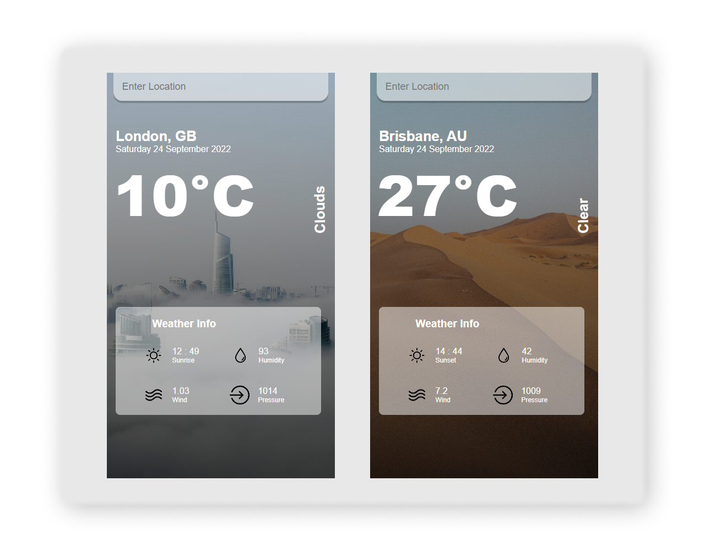

# React Weather App

## General info
This project is simple Weather App generator based on City. 
##### Check Out the website here: https://react-weather-app-generator.herokuapp.com/

## Setup
To run this project, install it locally using npm:

### Run below commands to make this code working

- #### Install react globally 
`npm install`

- ##### To view individual projects, run start command
`npm start` 

## Screenshots

<!-- If you have screenshots you'd like to share, include them here. -->
